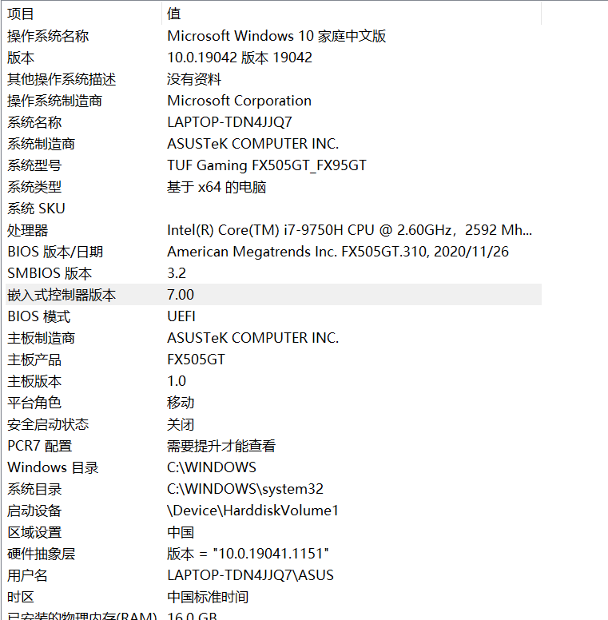
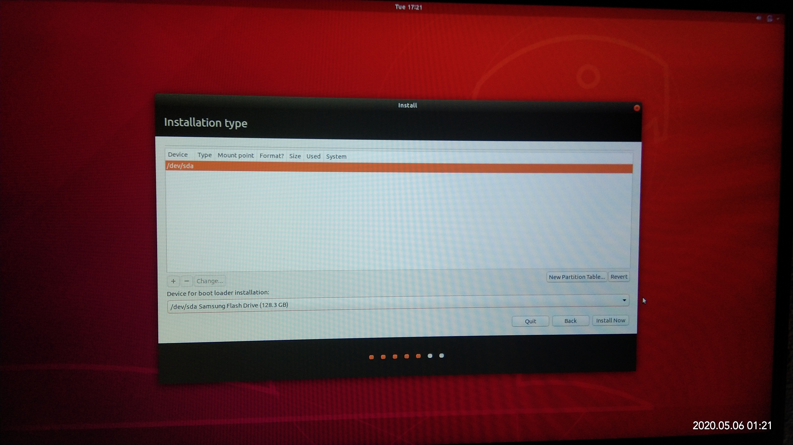

# Windows+Linux ubuntu双系统安装

参考资料：https://www.cnblogs.com/xlpc/p/12324535.html
#双系统 #Linux #Windows10

1. 清理磁盘空间(略)
   
2. 检查自己的bios类型
   win+r运行msinfo32
   
   发现BIOS模式为UEFI

3. 压缩磁盘驱动器以创建一个新的盘符
暂时分配40G空间（硬盘太小了！！！）不够到时候再整

4. 下载需要安装的系统镜像并制作U盘启动盘
(这里直接用现成的启动盘)

5. 插入U盘启动盘，重启电脑进入BIOS，在boot manager里将secure boot设置为disabled，并设置U盘启动，保存退出
6. 重启后进入ubuntu安装界面。一步步按照指示进行。在“安装类型”步骤出错：安装类型列表为空，如图。
   (图片来自网络)

7. 按照https://blog.csdn.net/weixin_43644231/article/details/105944192的方式尝试解决，在BIOS中将SATA Controller Mode设置为AHCI模式。之后为保证Windows系统能够运行，使用安全模式运行一次Windows系统，并重启，切换回ubuntu。
8. 按照步骤安装ubuntu系统，等待安装成功。遇到问题：找不到我的蓝牙鼠标

