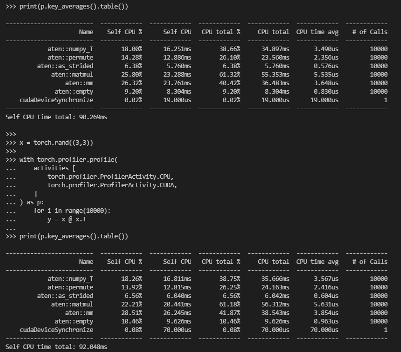
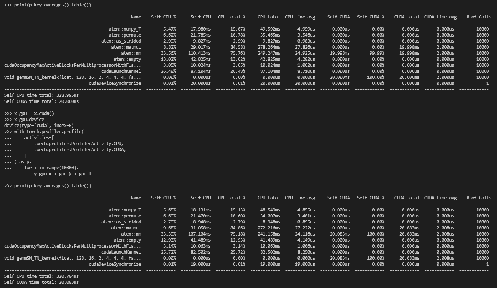

[toc]
# pytorch计时与GPU提速体验
==本篇撰写时间为2021.12.21，由于计算机技术日新月异，库中许多内容都有时效和版本限制，具体做法不一定总行得通，链接可能改动失效，各种软件的用法可能有修改。但是其中透露的思想往往是值得学习的。==
前置：
- [[tensor-calculator]]

本篇使用 #pytorch 中的`torch.autograd.profiler`计时。并验证什么情况下使用 #GPU #CUDA 并行（向量化）计算的确能提高计算速度。由于具体配置可能不同，数字只有相对比较意义
```
$ top #看CPU和内存
$ nvidia-smi #看GPU. 确保没有别的大东西在跑，方便复现有关时间的那些实验结果
$ python
>>> import torch
>>> torch.__version__
'1.9.0+cu102'
```
## `profile`计时体验
（`x`是随机生成的$3\times 3$方阵，即`x = torch.rand((3,3))`）
```
>>> with torch.autograd.profiler.profile(enabled=True) as prof:
...     for i in range(100):
...         y = x @ x.T
...         z = y * y
...         w = z + x
...
```
注：在交互式运行python时一次只能输入**一条**语句，故你不能尝试在`w = z + x`后直接加别的（和`with ...`并列的）语句，否则报错invalid syntax
此时各种东西被记录到`prof`中了
可以尝试`print(prof.key_averages().table())`
可以看到计时

## GPU对时间的影响
### 负面例子
- 为了实验可靠性，我们需要重复足够多次，让大数定律导致实验结果相对可复现（下面的10000要是改成100你就发现随机因素太大了）
先看CPU张量运算
交互界面依次输入
```
x = torch.rand((3,3))
```
```
with torch.profiler.profile(
    activities=[
        torch.profiler.ProfilerActivity.CPU,
        torch.profiler.ProfilerActivity.CUDA,
    ]
) as p:
    for i in range(10000):
        y = x @ x.T
```
```
print(p.key_averages().table())
```
- 对于10000次，可以看到大数定律加持下还是相当稳定的

	- 注：以上三条代码在有GPU的情况下，**第一次运算时会慢很多**，涉及到CUDA的初始化等。之后就正常了（“正常”即这个几乎没占时间）
	- 注：其中`activities`表示记录CPU也记录CUDA的运算。但是目前全是CPU运算
	- 注：官网https://pytorch.org/docs/stable/profiler.html#torch-profiler
有详细说明
- 那么，换成GPU张量试试
```
x_gpu = x.cuda()
```
```
x_gpu.device
```
```
with torch.profiler.profile(
    activities=[
        torch.profiler.ProfilerActivity.CPU,
        torch.profiler.ProfilerActivity.CUDA,
    ]
) as p:
    for i in range(10000):
        y_gpu = x_gpu @ x_gpu.T
```
```
print(p.key_averages().table())
```
- 仍然是10000次，仍然忽略第一次运行这些代码的结果，我们看到

CUDA计算本身很快，但各种辅助的CPU操作反而使得计算结果变慢了
### 正面例子
```
x = torch.rand((10000,10000))
```
```
with torch.profiler.profile(
    activities=[
        torch.profiler.ProfilerActivity.CPU,
        torch.profiler.ProfilerActivity.CUDA,
    ]
) as p:
    for i in range(10):
        y = x @ x.T
```
```
print(p.key_averages().table())
```
CPU运行11到13秒左右
```
x_gpu = x.cuda()
```
```
x_gpu.device
```
```
with torch.profiler.profile(
    activities=[
        torch.profiler.ProfilerActivity.CPU,
        torch.profiler.ProfilerActivity.CUDA,
    ]
) as p:
    for i in range(10):
        y_gpu = x_gpu @ x_gpu.T
```
```
print(p.key_averages().table())
```
结果
```
Self CPU time total: 2.533s
Self CUDA time total: 2.527s
```
结论：GPU适合**大**规模并行计算
## 向量化并行提速
此处主要验证python的`for`效率非常低下。所以能搞成张量（向量）并行的就一定要搞成张量（向量）并行
### 负面例子
首先普通地计算
```
with torch.profiler.profile(
    activities=[
        torch.profiler.ProfilerActivity.CPU,
        torch.profiler.ProfilerActivity.CUDA,
    ]
) as p:
    for i in range(20000):
        x_gpu = torch.rand((10,10), device=0)
        y_gpu = x_gpu * x_gpu
```
```
print(p.key_averages().table())
```
用时
```
Self CPU time total: 875.584ms
Self CUDA time total: 40.393ms
```
注：由于`profiler`本身开销，上述代码的运行时间可能让人感觉明显超过了他声称的时间
现在尝试向量化，看能不能提速
```
with torch.profiler.profile(
    activities=[
        torch.profiler.ProfilerActivity.CPU,
        torch.profiler.ProfilerActivity.CUDA,
    ]
) as p:
    for i in range(20):
        vec_gpu = torch.zeros((1000, 10, 10))
        for j in range(1000):
            x_gpu = torch.rand((10,10), device=0)
            vec_gpu[j] = x_gpu
        vec_res_gpu = vec_gpu * vec_gpu
```
```
print(p.key_averages().table())
```
但是这么搞本质上并没有提升（可以观察到实际上`for 20`和`for 1000`两层，实际上还是`for`了`20000`次）
结果：反而更慢了
```
Self CPU time total: 1.207s
Self CUDA time total: 40.182ms
```
### 正面例子

真正向量化提升速度的场景：比如说把`vec_gpu`这种一个“向量”存了起来，之后反复用。（刚刚`vec_gpu`只使用一次，所以优势不明显。如果可以反复用，而只需构造一次这种向量，那就好了！）
（下面当中`torch.dstack`以及类似的`torch.vstack`等用法参见官网。一个很常见的场景就是处理张量构成的`list`之类的）
```
def f():
    from time import time
    a = []
    for i in range(100):
        a.append(torch.rand((10,10), device=0))
    b = []
    for i in range(200):
        component = []
        for j in range(100):
            component.append(torch.rand((10,10), device=0))
        b.append(component)
    t = time()
    res = torch.zeros((len(b),10,10,100))
    a_tensor = torch.dstack(a) # a_tensor.shape现在是(10,10,100)
    for i in range(len(b)):
        bi_tensor = torch.dstack(b[i])
        res[i] = a_tensor * bi_tensor
    print(time() - t)
    t = time()
    res_slow = torch.zeros((len(b),10,10,100))
    for i in range(len(b)):
        for j in range(len(a)):
            res_slow[i,:,:,j] = a[j] * b[i][j]
    print(time() - t)
    print(res.equal(res_slow)) # 判断是否相等

f()
```
输出结果
```
0.046735525131225586
1.034254550933838
True
```
## 总结
为了pytorch的使用真正能提升 #性能 ，请确认
- 是否在做大规模计算
- 是否能显著减少`for`循环等CPU控制流使用
- 是否能用上`tensor`等做计算专用的数据结构（而不是低效的`list`）

无脑乱用CUDA，乱用pytorch，反而可能有负面效果！