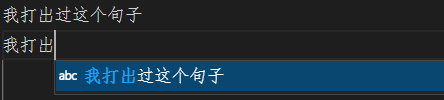
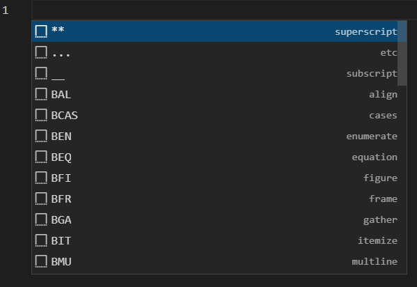

# vscode snippets
snippets就是打包好的常见代码段，可以提升 #编辑 的 #工作效率
- #VSCode 中有适当插件时，使用`Ctrl + Space`快捷键可以插入snippets
  - 如果输入法占用了`Ctrl + Space` #快捷键 需要手动关掉
- 对于 #中文支持 不好的环境，由于分词问题，会把没有空格分开的都当成一个词，所以你先打入几个汉字，然后`Ctrl + Space`并不能给出正常的snippets建议，而是在之前的汉字基础上给snippets建议。例如

- 比如在`.tex`环境中，按`Ctrl + Space`可以调出

（需要`LaTeX Workshop`插件）
  - 上面的`BFI`（`figure`）回车，就出现了
```latex
\begin{figure}[htbp]
    \centering
    
    \caption{<caption>}
    \label{<label>}
\end{figure}
```

- 在 #vscode的json配置 里面加入 `"editor.tabCompletion": "on"`，就可以使用`Tab`补全功能
- 增加snippets：可以找`@category:"snippets"`的 #vscode插件 ，注意安装完需要重启vscode生效
## 设置自己的snippets
- 一般是`Files > Preferences`（在MacOS上`Code > Preferences`），然后`User Snippets`
- 然后上方框中输入语言名称（比如`markdown`）
- 然后看到打开了一个`.json`（比如`markdown.json`）
- 举例：如果输入了如下配置
```json
	"Text Back Quote":{
		"prefix": "BQ",
		"body": "<code>&#96;</code>",
		"description": "Use HTML to insert a text back quote"
	},
	"Text Back Quotes":{
		"prefix": "BQs",
		"body": "<code>&#96;$0&#96;</code>",
		"description": "Use HTML to insert 2 text back quotes"
	}
```
保存了，那么之后只要在`.md`环境，就可以使用名字是`BQ`和`BQs`，效果是打出文字反引号<code>&#96;</code>，或两个文字反引号<code>&#96;&#96;</code>的snippets.
注：这里使用的是[[HTML转义字符]]
具体`$0`的含义，以及`$1,$2`等含义在vscode自带的`markdown.json`的注释里解释得很清楚
```json
	// Place your snippets for markdown here. Each snippet is defined under a snippet name and has a prefix, body and 
	// description. The prefix is what is used to trigger the snippet and the body will be expanded and inserted. Possible variables are:
	// $1, $2 for tab stops, $0 for the final cursor position, and ${1:label}, ${2:another} for placeholders. Placeholders with the 
	// same ids are connected.
	// Example:
	// "Print to console": {
	// 	"prefix": "log",
	// 	"body": [
	// 		"console.log('$1');",
	// 		"$2"
	// 	],
	// 	"description": "Log output to console"
	// }
```
